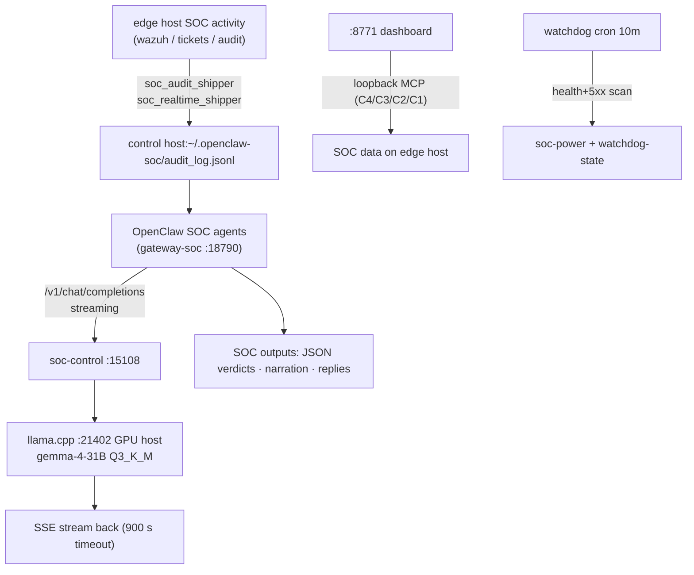

# SOC LLM Stack — Architecture & Operations (2026-09-25)

**Scope:** the three-host SOC system spanning `edge host` (data plane + dashboard),
`control host` (OpenClaw SOC gateway + power panel), and `GPU host` (llama.cpp LLM serving).
Written after the minimax-m3 → llama.cpp migration and the :15108 power-panel build.

> Related repo: `~/laya-control` (control host + mirrored to edge host) — installer,
> `server.py` (panel+proxy), `watchdog.sh`, systemd units, `docs/WORKLOG.md`.

---

## 1. Architecture

```mermaid
flowchart LR
    subgraph Edge host["edge host — SOC data plane + dashboard<br/>192.0.2.188 / 192.0.2.106 / 100.64.0.51"]
        DASH[":8771 SOC Dashboard (Track D)<br/>read-only fleet view over loopback MCP"]
        MCPF["MCP fleet in /opt/soc-openclaw/services<br/>soc-audit-mcp (C4 audit-log)<br/>soc-tickets-mcp (C3) · soc-manager-mcp (C2)<br/>soc-wazuh-mcp (C1 indexer) · soc-memory-mcp<br/>soc_evidence / soc_score / soc_routing / soc_stig*"]
        ING["realtime-ingest · imap-watcher · scanner<br/>daily-decisions · soc_tasklog"]
    end

    subgraph TROOP2["control host — agent + LLM control plane<br/>100.64.0.17 / 192.0.2.70"]
        GW[":18790 openclaw-gateway-soc.service<br/>agents: soc-triage / narrator / replier<br/>incident-reviewer / ioc-enricher / comms"]
        CTRL[":15108 soc-control.service<br/>power panel + streaming /v1 proxy"]
        WD["watchdog.sh — cron every 10m<br/>ALERT on working / BROKEN transitions"]
        AUDIT["~/.openclaw-soc/audit_log.jsonl<br/>(shipped from edge host, ~10M)"]
    end

    subgraph GPU host["GPU host — LLM host · 2×16GB GPU<br/>100.64.0.61"]
        L31B[":21402 soc-llama-31b.service<br/>llama.cpp · gemma-4-31B Q3_K_M<br/>131k ctx · tool calls OK"]
        L8B[":21401 llama-server<br/>norahalpined 8B Q4_K_M (untouched)"]
        VM["5 qemu-system VMs<br/>verify-aai/pve-vm/*.qcow2<br/>debian-13 · pve-disk ×4 · rocky9 · rocky-scan"]
    end

    Edge host -- "soc_audit_shipper +<br>soc_realtime_shipper (crons)" --> AUDIT
    AUDIT --> MCPF
    MCPF --> DASH
    W -->|"console :8771"| DASH
    O -->|"POST /v1/chat/completions"| GW
    GW -->|"provider GPU host →<br>http://127.0.0.1:15108/v1"| CTRL
    CTRL -->|"streaming /v1/*<br>(900s timeout)"| L31B
    W -->|"power panel<br>POST /power/on|off"| CTRL
    CTRL --|"ssh + systemctl<br>(power switch)"--> L31B
```

*(the SOC agents are OpenClaw agents — they run inside `openclaw-gateway-soc` and
call their tools through the gateway; the LLM serving chain is
`gateway → soc-control proxy :15108 → llama.cpp :21402 on GPU host`.)*

## 2. Ports & services inventory

| Host | Port | Service | Unit / process | Serves |
|---|---|---|---|---|
| edge host | **8771** | `python3 /opt/soc-openclaw/services/soc-dashboard/server.py` (pid 2527) | (manual start — supervisor unverified) | SOC Dashboard: `/`, `/tenants/<id>`, `/agents/<id>`, `/runs/<id>`, `/healthz`, `/tools.json` |
| edge host | loopback | MCP fleet: soc-audit-mcp (C4), soc-tickets-mcp (C3), soc-manager-mcp (C2), soc-wazuh-mcp (C1), soc-memory-mcp, soc-evidence | — | dashboard data + agent tools |
| edge host | cron | realtime-ingest, imap-watcher, scanner, daily-decisions, soc_tasklog, soc_score, soc_routing, soc_stig* | — | edge host-side SOC pipeline |
| control host | **15108** | `soc-control.service` (server.py, restart=always) | power panel + streaming `/v1/*` proxy → GPU host:21402 (900 s upstream timeout, chunk-flushed for SSE) |
| control host | **18790** | `openclaw-gateway-soc.service` — OpenClaw SOC gateway (`OPENCLAW_STATE_DIR=/home/operator/.openclaw-soc`) | agents: soc-triage, soc-narrator, soc-replier, soc-incident-reviewer, soc-ioc-enricher, soc-comms |
| control host | **8099** | `laya-serve.service` (user unit, enabled 2026-09-26) | Laya decision server — typed choice/score/noul decisions, loopback-only, CPU, 4.7 GB RAM; see `docs/LAYA-SETUP.md` |
| control host | — | `watchdog.sh` via cron `soc-llm-watchdog` (10 min) | checks 15108 `/v1/models` + `/health`, gateway unit, port 18790, fresh `status=5xx` in gateway journal (90 s window); silent unless state changes |
| GPU host | **21402** | `soc-llama-31b.service` — llama.cpp, gemma-4-31B Q3_K_M, 131k ctx, q4_0 KV, --jinja, --metrics | SOC LLM (tool calls verified ✓) |
| GPU host | **21401** | llama-server — norahalpined 8B Q4_K_M (131k ctx, no native tool calls — 500 `peg-native` on tools=[]) | untouched, not systemd-managed |

## 3. LLM serving — measured (2026-09-25)

| Metric | Value |
|---|---|
| SOC turns (3908 total, all-time) | avg **~120k input** tok/turn · max ~510k · avg output **~164 tok** |
| GPU host llama.cpp | PP ~364 tok/s cold · **~600+ tok/s cached** (LCP/LRU slot reuse, sim 0.968) · decode ~10.8 tok/s |
| Real SOC turn (79.5k ctx) | **16.1 s** (cache hit) · cold 75k turn **77.7 s** |
| llama.cpp counters (`:15108/metrics`) | `llamacpp:prompt_tokens_total 3.28M` · `tokens_predicted_total 30.6k` · decode `n_decode_total 102k` |
| GPU draw (idle → active) | GPU0 32 W → **150.8 W @100%** · GPU1 28.6 W → 101.4 W · VRAM 15.2+15.1 / 15.9 GB each |

Models on GPU host (`~/models`, 15G after dupe removal):

| GGUF | Size | State |
|---|---|---|
| `gemma-4-31B-it-Q3_K_M` | 14G | **serving :21402** (SOC LLM) |
| `mmproj-BF16` | 1.2G | multimodal projector (kept) |
| ~~`gemma-4-31B-it-Q4_K_M`~~ | ~17G | **removed** — unused duplicate |

## 4. Power switch

Panel: `http://control host:15108/` · actions `POST /power/on` / `POST /power/off` · live `GET /status`.

| Action | Sequence |
|---|---|
| **ON** | ssh GPU host → `systemctl --user start soc-llama-31b.service` → wait `/health`=200 (≤2 min cold) → `systemctl --user start openclaw-gateway-soc.service` |
| **OFF** | stop `openclaw-gateway-soc` → stop `soc-llama-31b` on GPU host (over SSH) |
| state file | `~/.openclaw-soc/soc-power` (`on` / `off`) — watchdog reads it; **operator OFF is silent** |

## 5. Watchdog (alerts)

`~/.openclaw-soc/watchdog.sh` + OpenClaw cron `soc-llm-watchdog` (10 min, isolated →
operator session, `NO_REPLY` when unchanged):

- `http://127.0.0.1:15108/v1/models` = 200
- `http://127.0.0.1:15108/health` = 200 (or llama unit `active`/`activating` on GPU host)
- `openclaw-gateway-soc.service` active + port 18790 listening
- fresh `status=5xx` model-fetches in the SOC gateway journal (90 s window)
- power-state aware: `soc-power=off` → silent

**Never probe by completing a chat** from the watchdog — with a single llama.cpp
slot it queues behind real turns (minutes at 75k ctx) and its timeout **cancels the
real turn** (observed in llama.cpp logs: `stop: cancel task`).

## 6. Data flows



## 7. Disk (post-cleanup 2026-09-25)

- **control host `/`: 187G used / 295G (67%) — freed 47G today**
  - removed: 2 dead healthcheck cron jobs + their minimax-m3 GGUF-era leftovers,
    `soc-demo-backup-2026-08-11` (6.3G), `~/archive` (1.9G, forge trash),
    `openclaw.json` .bak chain, GGUF dirs (`gemma4` E4B 5.0G, `gemma4-12b` 6.9G,
    `models/` Llama-3.2-3B + Qwen2.5-7B 6.3G), llama.cpp-models `.git` LFS cache (6.3G),
    pip/apt/npm/go-build/electron/node-gyp caches (~9.9G), journald vacuum (1.4G),
    `/tmp/{stigwork,snl-gms-sync,cicerone-e2e}` (~2.7G), docker prunes (~50G incl.
    build cache + shared-layer accounting)
- **GPU host `/`: 150G used / 393G (41%) — freed 182G today**
  - docker fully emptied (was 126.9G images / 53 total / 8 active + 10.06G build cache
    + 84M containers + 8.4G `alpine-emulator_shared-data` volume of `compute_pi-*` logs)
  - removed: `training-llama/runs/gguf/norahalpined-f16.gguf` (~16G) +
    `Q5_K_M.gguf` (~5.9G) + `models/gemma-4-31B-it-Q4_K_M.gguf` dupe (~17G) +
    `verify-aai/pve-vm/pve*.qcow2` ×4 (~27G)
  - kept: `runs/gguf/norahalpined-Q4_K_M.gguf` 4.6G (serving :21401), HF cache
    9.8G (photoreal/Hunyuan3D), `.venvs/llama-tools` 4.9G, `~/models` Q3 serving
- 8 old kernels autoremoved on GPU host; journald vacuumed 1.5G → 500M

## 8. Gotchas (field-tested)

1. **Tool calling is a model property.** llama.cpp returns
   `500 … does not match the expected peg-native format` for models that break the
   tool-call grammar (llama3-8b finetune failed; gemma-4-31B passed). `/v1/models`
   `capabilities:["completion"]` is **not authoritative** — verify with a live call.
2. **Thinking models** (gemma-4-31B emits `reasoning_content`) eat `max_tokens`
   before any `content` — tiny-budget probes look like "empty replies".
3. **Never watchdog-probe with a chat completion**: single llama.cpp slot queues the
   probe behind real turns (minutes at 75k ctx) and its timeout **cancels the real
   turn** (observed `stop: cancel task, id_task=…`). Probe `/health` + `/metrics` +
   journal 5xx scan instead.
4. llama.cpp returns **503** while loading / slot unavailable — transient at model
   load windows; watchdog treats brief 5xx bursts as signal, 90 s window.
5. Metric names are **`llamacpp:*`** (colons) — `llama_*` greps match nothing.
6. llama.cpp built-in web UI: this build returns **415** on `GET /` even with
   `Accept: text/html` — no asset bundle. The soc-control panel replaces it at
   :15108 root.
7. `docker volume prune` only removes **anonymous** volumes — named volumes (e.g.
   `alpine-emulator_shared-data`, 8.4G) need `docker volume rm`.
8. llama.cpp prompt cache (LCP/LRU slot reuse) turns repeat SOC turns from minutes
   into ~16 s — avoid anything that busts slot state.
9. `git status` clean can hide LFS bloat: `~/llama.cpp-models/.git` held 6.3G of
   LFS-cached GGUFs after the working tree was deleted. Check `.git` size too.

## 9. Remaining (deliberate)

- GPU host: `training-llama/runs/final` fp16 safetensors (15G) + HF cache 9.8G + `.venvs/llama-tools`
  4.9G — finetune artifacts, kept pending a "no more finetunes" call
- GPU host disk at 41% — headroom OK
- edge host `:8771` dashboard is LLM-agnostic (thin MCP shim) — unaffected by the LLM move

## 10. Quick URLs

| URL | What |
|---|---|
| `http://control host:15108/` | SOC power panel (ON/OFF + live status) |
| `http://control host:15108/v1/models` | llama.cpp OpenAI-compatible model list |
| `http://control host:15108/metrics` | `llamacpp:*` Prometheus counters |
| `http://control host:15108/health` | llama health |
| `http://control host:18790/` | OpenClaw SOC gateway console |
| `http://192.0.2.106:8771/` (edge host LAN) | SOC Dashboard (Track D) |
| `http://100.64.0.51:8771/` (tailnet) | same dashboard via tailnet |
| `http://GPU host:21402/` · `http://100.64.0.61:21402/` | llama.cpp API (direct) |

---

*Generated 2026-09-25 18:31 UTC · verified by live probes (all URLs 200)*